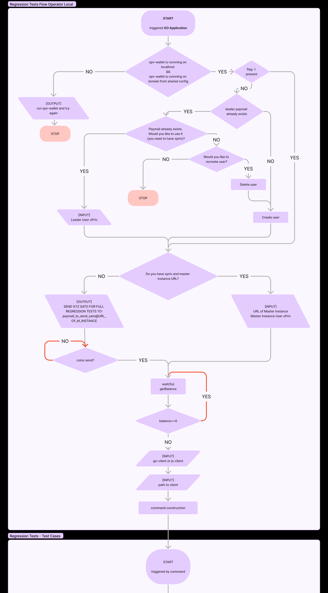

# SPV Wallet Regression Tests Operator

## About

This simple program helps you prepare to and run regression tests of the SPV Wallet.

## Table of Contents

- [About](#about)
- [Features](#features)
- [Prerequisites](#prerequisites)
- [Installation](#installation)
- [Configuration](#configuration)
- [Usage](#usage)
- [Operator Flow](#operator-flow)
- [License](#license)

## Features

- **Users**: Creates, recreates, or uses existing user.
- **Funds Transfers**: Handle funds transfers to ensure user have the required balance, possibility of self-transfer or transfer with xpriv and domain.
- **Test Execution**: Run regression tests using either the Go or JS SPV Wallet client.
- **Configuration Management**: Load (-l flag) and save configuration settings from a `.env.config` file.

## Prerequisites

- **SPV wallet**: running on localhost:3003
- **localhost:3003**: tunneled to domain specified in config (domain used for paymail domain validation)

## Configuration

The application uses a `.env.config` file to manage configuration settings. Here are the required environment variables:

- `CLIENT_ONE_URL`: URL for the first SPV Wallet client.
- `CLIENT_TWO_URL`: URL for the second SPV Wallet client.
- `CLIENT_ONE_LEADER_XPRIV`: Extended private key for the first client leader.
- `CLIENT_TWO_LEADER_XPRIV`: Extended private key for the second client leader.

To run the program with the configuration from a file, use the -l flag.

In local testing, we use only one client and one user so operator client one url is equal to client url two and client one leader xpriv is equal to client two leader xpriv.

### Sample .env.config File

```bash
CLIENT_ONE_URL="example.com"
CLIENT_TWO_URL="example.com"
CLIENT_ONE_LEADER_XPRIV="xprv..."
CLIENT_TWO_LEADER_XPRIV="xprv..."
```

## Usage

```bash 
cd regression_tests
go run .
```
or using .env.config
```bash 
cd regression_tests
go run . -l
```

## Operator Flow




## License

[](LICENSE)
